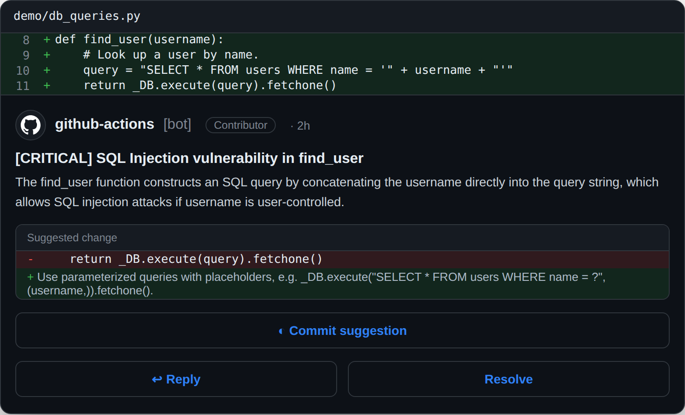

<p align="center">
  
</p>

# lgtmaybe

AI code review for **GitHub, GitLab, and Gitea**, or your local Git diff. Choose
from seven hosted providers, ollama, or any OpenAI-compatible endpoint. Reviews
post inline findings and a summary on pull and merge requests; the CLI prints
findings locally. Bedrock, Vertex, and Azure support keyless cloud auth.

📖 **Full documentation:** <https://lgtmaybe.coles.codes/>

## What it reviews

lgtmaybe fetches a pull or merge request's diff through the code host API, or
reads your local Git diff. It reads surrounding lines for context and comments
only on changed lines. It does not check out or run pull request code.

Findings are graded from `info` to `critical`. The built-in lenses look for:

- **Correctness and security** — logic errors, missed `await`s, injection,
  broken authorization, leaked secrets, and CI configuration risks.
- **Tests and documentation** — missing coverage for changed behavior,
  undocumented public APIs, and docs made stale by the change.
- **Code health** — deprecated APIs, risky dependencies, performance
  regressions, and needless complexity.
- **Intent** — changes that contradict the PR title, description, or commits,
  or leave promised behavior unimplemented.
- **Ponytail** — code that need not exist, including opportunities to use the
  standard library or a simpler approach.

[What gets reviewed](docs/explanation/what-gets-reviewed.md) has the full scope
and examples.

Generated files, lockfiles, vendored code, and binaries are skipped. The diff
is treated as untrusted input, and detected secrets are redacted before model
calls. See [Data and Privacy](docs/explanation/data-and-privacy.md) for what is
sent to a provider and how prompt injection is handled.

**Fast by default.** The `fast` preset covers all nine built-in categories in
four model calls: security, correctness, code health, and tests/documentation.
`--preset full` runs each category separately for a deeper audit. A matching
committed spec can add a separate spec-review call. Calls share a concurrency
limit; providers that support prompt caching can reuse the diff prefix. Add
`--profile` to see time and token use.

**Large changes stay bounded.** The main controls are:

- `max_files` (default 50) limits the changed files reviewed and reports skips.
- `max_input_tokens` (default 100k) splits the diff into batches.
- `recursive` (on by default) reviews an oversized file hunk by hunk;
  `--no-recursive` turns this off.
- `max_concurrency` (default 6) limits simultaneous model calls. Local server
  settings also affect how many calls can run at once.
- `categories`, `min_severity`, and path filters narrow what runs and what is
  reported. An explicit category list runs one call per selected lens.

See [Configure .lgtmaybe.yml](docs/how-to/configure-lgtmaybe-yml.md) for every knob.

For the measured recall and token cost of hunk-by-hunk review on a small local
model, see [the recursive-review benchmark](DEVELOPMENT.md#benchmarking-the-recursive-rlm-walk).

**What you get back.** Each finding includes a file, line, severity, title,
explanation, and sometimes a suggested fix:

- **On a pull or merge request**, findings appear on changed lines alongside
  one summary naming the model. Re-runs update the summary and avoid duplicate
  findings. A clean review gets a 👍 **LGTM!**. GitHub and GitLab can resolve
  conversations once a fix is verified; Gitea cannot. See [Where it posts](#where-it-posts).
- **On the CLI**, `lgtmaybe review` prints findings without posting them.
  Choose readable output, JSON (`--json`), or instructions for a coding agent
  (`--format agent`).

Slash commands add more options on a pull or merge request: `/review` and
`/improve` refresh the review, `/ask <question>` answers in the conversation,
`/describe` posts a structured description, and `/diagram` posts a change
overview. The overview includes high-impact areas and a Mermaid flowchart;
it adds a sequence diagram when the change alters a runtime flow. Run
`lgtmaybe diagram` for a local text version. See
[Generate a change overview](docs/how-to/generate-a-change-diagram.md).

On GitHub, a push triggers an incremental review of new commits. Optional
`triage_model` skips plainly non-substantive files. Optional `static_analysis`
uses installed tools: ruff, bandit, mypy, and semgrep provide hints to the
model; gitleaks, zizmor, ast-grep, and osv-scanner can post deterministic
findings directly. See [Reduce review cost](docs/how-to/reduce-review-cost.md).

<p align="center">
  
</p>

<p align="center"><em>On a GitHub PR — an inline comment on the changed line. The same findings on the CLI:</em></p>

<p align="center">
  
</p>

A fuller walkthrough with example output is in
[What gets reviewed](docs/explanation/what-gets-reviewed.md).

## Quick start (local, no API key)

Start ollama and pull a model as shown in [Getting Started](docs/tutorial/getting-started.md).
Then, from a Git branch with changes, review the diff against the primary branch:

```bash
pip install lgtmaybe        # or Homebrew — see docs/how-to/install-the-cli.md

lgtmaybe review \
  --provider ollama \
  --model qwen3.6:27b \
  --api-base http://localhost:11434
```

No GitHub token and no pull request needed — `lgtmaybe review` reads your local
`git` diff and prints the findings. Its companion, `lgtmaybe diagram`, takes the
same flags and prints the change overview — what your change is, its high impact
areas, and a picture of the components it touches and the flow it alters.
`review` then `diagram` is the pair to run before opening a pull request. See
[Generate a change overview](docs/how-to/generate-a-change-diagram.md).

`lgtmaybe --help` lists every command with usage examples; `lgtmaybe review --help`
shows the full option reference. To post reviews on real pull requests, wire up
the [GitHub Action](#use-as-a-github-action) — or, on another host,
[GitLab CI](docs/how-to/review-on-gitlab.md) or
[Gitea Actions](docs/how-to/review-on-gitea.md). See
[Getting Started](docs/tutorial/getting-started.md) for the full walkthrough.

For model choices and benchmark limits, see [Choose a review model](docs/how-to/choose-a-review-model.md).

## Providers

| Provider | Auth | Guide |
|---|---|---|
| `openai` | `OPENAI_API_KEY` | [OpenAI](docs/how-to/review-with-openai.md) |
| `anthropic` | `ANTHROPIC_API_KEY` | [Claude](docs/how-to/review-with-anthropic.md) |
| `openrouter` | `OPENROUTER_API_KEY` | [OpenRouter](docs/how-to/review-with-openrouter.md) |
| `zai` | `ZAI_API_KEY` — GLM / Zhipu AI (`glm-4.6`, `glm-4.7`, `glm-4.5-air`, …; newer `glm-5.x` too). Optional `--api-base` for the China / coding-plan endpoint | [z.ai (GLM)](docs/how-to/review-with-zai.md) |
| `bedrock` | Ambient AWS creds — GitHub OIDC, no static key | [Bedrock](docs/how-to/review-with-bedrock-oidc.md) |
| `vertex` | Ambient GCP creds — Workload Identity Federation, no key | [Vertex](docs/how-to/review-with-vertex-wif.md) |
| `azure` | Ambient Azure AD creds — GitHub OIDC, no static key (or `AZURE_API_KEY`) + endpoint | [Azure](docs/how-to/review-with-azure.md) |
| `ollama` | None — local only, zero cost | [ollama](docs/how-to/run-locally-with-ollama.md) |
| `openai-compatible` | Any OpenAI `/v1` endpoint via `--api-base` (DeepSeek, llama.cpp, LM Studio, vLLM). Key optional — `--api-key` / `OPENAI_COMPATIBLE_API_KEY`, or none for local servers | [Local & OpenAI-compatible](docs/how-to/use-a-custom-openai-compatible-endpoint.md) |

## Where it posts

The model provider and the code host are independent choices — any provider
above works on any host below.

| Host | How it runs | Token | Guide |
|---|---|---|---|
| GitHub | GitHub Action (`MattJColes/lgtmaybe@v2`) | `GITHUB_TOKEN` | [GitHub Action](docs/how-to/use-as-github-action.md) |
| GitLab | GitLab CI job (`lgtmaybe gitlab-ci`) | `GITLAB_TOKEN` | [Review on GitLab](docs/how-to/review-on-gitlab.md) |
| Gitea | Gitea Actions (same container) | `GITEA_TOKEN` | [Review on Gitea](docs/how-to/review-on-gitea.md) |
| None | `lgtmaybe review` on your local diff | — | [Install the CLI](docs/how-to/install-the-cli.md) |

The review is the same everywhere — same lenses, same reflection pass, same
findings. What differs is what each host's API can do with the result:

| | GitHub | GitLab | Gitea |
|---|---|---|---|
| Inline comments + summary | ✅ | ✅ | ✅ |
| Slash commands | ✅ | ✅ | ✅ |
| Auto-resolve a fixed finding | ✅ | ✅ | ✗ no thread API |
| Incremental re-review | ✅ | not yet | ✗ no compare diff |
| Keyless cloud auth (OIDC/WIF) | ✅ | ✗ use an API key | ✗ use an API key |

## Documentation

Browse the rendered docs at <https://lgtmaybe.coles.codes/>, or read the
Markdown sources below. For LLM agents, a curated
[`llms.txt`](https://lgtmaybe.coles.codes/llms.txt) index (and a
whole-corpus [`llms-full.txt`](https://lgtmaybe.coles.codes/llms-full.txt))
are published at the docs root.

**Tutorial** — learn by doing

- [Getting Started](docs/tutorial/getting-started.md) — your first review with ollama

**How-to guides** — task recipes

- [Choose a review model](docs/how-to/choose-a-review-model.md)
- [Review with OpenAI](docs/how-to/review-with-openai.md)
- [Review with Claude (Anthropic)](docs/how-to/review-with-anthropic.md)
- [Review with OpenRouter](docs/how-to/review-with-openrouter.md)
- [Review with z.ai (GLM)](docs/how-to/review-with-zai.md)
- [Review with Bedrock OIDC](docs/how-to/review-with-bedrock-oidc.md)
- [Review with Vertex WIF](docs/how-to/review-with-vertex-wif.md)
- [Review with Azure OpenAI](docs/how-to/review-with-azure.md)
- [Run locally with ollama](docs/how-to/run-locally-with-ollama.md)
- [Local models & other OpenAI providers](docs/how-to/use-a-custom-openai-compatible-endpoint.md)
- [Use as a GitHub Action](docs/how-to/use-as-github-action.md)
- [Review on GitLab](docs/how-to/review-on-gitlab.md)
- [Review on Gitea](docs/how-to/review-on-gitea.md)
- [Configure .lgtmaybe.yml](docs/how-to/configure-lgtmaybe-yml.md)
- [Releasing (maintainers)](docs/how-to/releasing.md)

**Reference** — look things up

- [Configuration Reference](docs/reference/config.md) — all config fields and schemas (generated)

**Explanation** — understand the design

- [What gets reviewed](docs/explanation/what-gets-reviewed.md) — scope, caps, and what the output looks like
- [Architecture](docs/explanation/architecture.md) — ports and adapters, the review pipeline
- [Auth Model](docs/explanation/auth-model.md) — why keyless cloud, how credential resolution works
- [Data and Privacy](docs/explanation/data-and-privacy.md) — what is sent where, secret redaction, ollama local mode
- [Trust and Cost](docs/explanation/trust-and-cost.md) — choosing who reviews run for (everyone, trusted contributors, or admins) and the small cost angle

## Use as a GitHub Action

Use lgtmaybe from the
[GitHub Marketplace](https://github.com/marketplace/actions/lgtmaybe). It is a
GitHub Action, so its settings live in your workflow. In
`.github/workflows/lgtmaybe.yml`, set `provider`, `model`, and the matching
authentication input in the step's `with:` block. This complete example uses
OpenAI:

```yaml
name: lgtmaybe

on:
  pull_request_target:
  issue_comment:
    types: [created]

permissions:
  contents: read
  pull-requests: write

jobs:
  review:
    # A comment only starts a job when it carries one of lgtmaybe's slash
    # commands — issue_comment fires on every comment on every PR.
    if: >-
      github.event_name == 'pull_request_target' ||
      (github.event.issue.pull_request &&
       (contains(github.event.comment.body, '/review') ||
        contains(github.event.comment.body, '/improve') ||
        contains(github.event.comment.body, '/ask') ||
        contains(github.event.comment.body, '/describe') ||
        contains(github.event.comment.body, '/diagram')))
    runs-on: ubuntu-latest
    steps:
      - uses: actions/checkout@v6
      - uses: MattJColes/lgtmaybe@v2
        with:
          provider: openai
          model: gpt-5.5
          api_key: ${{ secrets.OPENAI_API_KEY }}
```

Using a different **model provider**? Copy-paste workflows for every cloud and
API-key provider live in
[`examples/workflows/`](examples/workflows/). Cloud providers (Bedrock, Vertex,
Azure) are **keyless** — pass `aws_role_arn` / `gcp_wif_provider` /
`azure_client_id` and the action does the OIDC/WIF exchange for you (needs
`id-token: write`). See
[Use as a GitHub Action](docs/how-to/use-as-github-action.md). ollama is local
only — run it through the [CLI](docs/how-to/run-locally-with-ollama.md) instead.

### Not on GitHub?

lgtmaybe runs the same review on GitLab and Gitea. Only the wiring changes:

- **GitLab** — a CI job running `lgtmaybe gitlab-ci`, gated on merge request
  pipelines. See [Review on GitLab](docs/how-to/review-on-gitlab.md) and
  [`examples/gitlab/`](examples/gitlab/).
- **Gitea** — Gitea Actions runs the same container as GitHub, because it
  reimplements the same runtime. See
  [Review on Gitea](docs/how-to/review-on-gitea.md) and
  [`examples/gitea/`](examples/gitea/).

Keyless cloud auth is a GitHub Actions feature, so on GitLab and Gitea use an
API-key provider — or `ollama` against a runner-local model for zero cost.

By default, reviews post as `github-actions[bot]`. To post as
`lgtmaybe[bot]`, install the public
[lgtmaybe App](https://github.com/apps/lgtmaybe/installations/new), grant the
workflow `id-token: write`, and add `github_identity: lgtmaybe` beside the
provider settings. You never receive or manage the App's private key. lgtmaybe
is still the Action running in your workflow; the App changes only the GitHub
author identity. See
[Post as lgtmaybe[bot]](docs/how-to/post-as-a-github-app.md).

> **🔧 Choose who can trigger reviews.** You decide who reviews run for —
> everyone, trusted contributors, or just admins. The example workflows default
> to trusted contributors (`OWNER`, `MEMBER`, `COLLABORATOR`), and it's a
> one-line change to open it up or tighten it. With ollama this is free; on a
> hosted provider it also keeps token spend predictable. See
> [Who can trigger a review](docs/how-to/use-as-github-action.md#who-can-trigger-a-review)
> and [Trust and Cost](docs/explanation/trust-and-cost.md).

## Distribution

- **CLI (PyPI)** — `pip install lgtmaybe`
- **CLI (Homebrew)** — `brew tap MattJColes/tap && brew trust MattJColes/tap && brew install lgtmaybe`
  ([details](docs/how-to/install-the-cli.md) — the `brew trust` step is required for third-party taps)
- **CLI (WinGet, Windows x64)** — `winget install --id MattJColes.lgtmaybe --exact`
  ([details](docs/how-to/install-the-cli.md#install-on-windows-winget))
- **GitHub Action** — `uses: MattJColes/lgtmaybe@v2`

## Contributing

Test-first, green CI, scope is the gate. See [CONTRIBUTING.md](CONTRIBUTING.md).

## License

MIT — see `LICENSE`.
