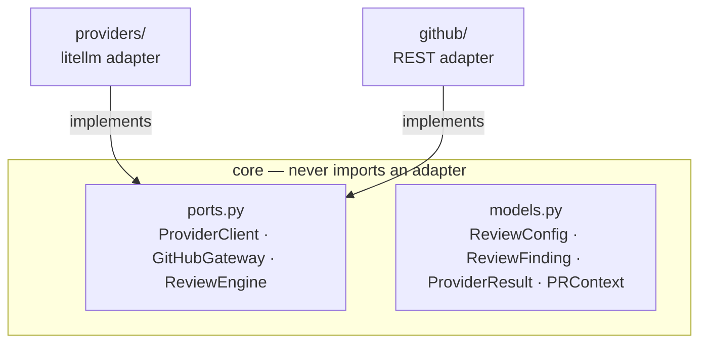
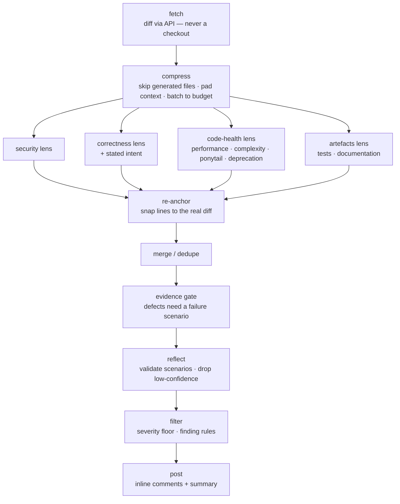

# Architecture

lgtmaybe is built on **hexagonal architecture** (ports and adapters). The core
never imports from the adapters; adapters implement abstract ports defined in
`core/ports.py`. This lets the parallel build tracks evolve independently and
lets tests swap in fakes without patching.

## Ports and adapters



**`core/ports.py`** — the seam. Three abstract base classes:

- `ProviderClient` — one method: `complete(messages, model)` returns a
  `ProviderResult` (text + token usage).
- `GitHubGateway` — `get_pr_context()` fetches the PR diff and metadata;
  `post_review()` posts batched inline comments and a summary;
  `post_issue_comment()` posts a standalone comment (used by `/ask` and as the
  describe/diagram fallback).
- `ReviewEngine` — `review(ctx, cfg)` returns `(findings, summary)`.

The ports were frozen in the foundation step. Other tracks (providers, github,
engine, CLI) build against these stable signatures. Changing a port requires
consensus across all tracks.

## Review pipeline

The engine executes a pipeline of composable stages in sequence:

```
fetch → compress → prompt → parse → re-anchor → merge/dedupe → evidence gate → reflect → filter → post
```

The prompt/parse stage is where the pipeline fans out — one concurrent model
call per review lens — before the findings funnel back into a single stream:



(The four lens calls shown are the `fast` grouping, and they are the same four
on every provider — worker count decides only whether they overlap. The `full`
preset fans out one call per category, and custom lenses join the same fan-out.)

1. **fetch** — `GitHubGateway.get_pr_context()` retrieves the PR diff and
   metadata from the GitHub REST API. No PR code is checked out or executed.
   The diff is treated as untrusted input throughout.

2. **compress** — the diff is filtered to remove generated files, lockfiles,
   minified assets, and vendored code. Path filters from `ReviewConfig` are
   applied. Each remaining hunk is then padded with surrounding context lines
   from the head revision of the file (fetched by the gateway, never a
   checkout), capped by `context_lines` and the remaining token budget. The
   result is batched to fit `max_input_tokens` (and, when `recursive` is on, an
   over-budget single file is walked hunk-by-hunk rather than sent whole). The
   expanded diff is for the model only — inline-comment positions are always
   rebuilt from the **real** diff at post time, so a finding on an added context
   line maps to nothing and is dropped rather than mis-posted.

3. **prompt + parse** — this stage **fans out one model call per review
   lens**. The `preset` decides the lens set. `fast` (the default) covers all
   nine categories in **four calls**, one per concern: security, correctness
   (with stated intent when present), merged code health (performance/
   complexity/ponytail/deprecation), and artefacts (tests/documentation). The
   same four run on every provider — worker count changes only how they are
   scheduled. `full` runs one call per category. Every
   (batch, lens) task shares **one `ThreadPoolExecutor`** over the sync
   provider port, sized by `max_concurrency` (default 8 for cloud, 1 for
   ollama and openai-compatible), so batches never wait on each other.

   With `prompt_cache` on, each call is shaped as a shared cacheable prefix —
   a lens-independent system preamble, then the wrapped diff — followed by
   the lens-specific instruction as the final user block. On routes that
   take an explicit cache breakpoint (anthropic, bedrock Claude/Nova, vertex
   Claude and Gemini, zai GLM, and openrouter's claude/gemini/glm/minimax
   families)
   the prefix is marked with `cache_control`; on backends that cache
   automatically (OpenAI, Azure, DeepSeek) the identical prefix is enough on
   its own. Either way every call after a batch's first reads that
   preamble-plus-diff prefix from cache, and on big diffs a warm-up primer
   runs the first lens alone so a concurrent wave doesn't all miss it.

   Each lens's focused structured prompt requests JSON output with
   the `ReviewFinding` schema (`path`, `line`, `side`, `severity`, `title`,
   `body`, `failure_scenario`, `suggestion`, `anchor`) and carries
   prompt-injection defense instructions. Each response is parsed and validated against
   `ReviewFinding` using Pydantic; parse errors are logged and surfaced in
   the summary rather than silently discarded.

4. **re-anchor** — `_snap_findings` rebinds each finding's `line` to the real
   changed line whose content matches the finding's verbatim `anchor`, rather
   than trusting the model's line arithmetic. A finding whose anchor matches
   nothing is marked `anchored=False` and later demoted to the review body
   instead of being posted on a guessed line.

5. **merge/dedupe** — findings from every lens are merged and de-duplicated
   (`_dedupe`, keyed on path/line/side).

6. **evidence gate** — security, correctness, deprecation, and performance
   findings must carry a concrete `failure_scenario`: the trigger, changed
   behaviour, and observable impact. The engine applies this rule regardless
   of model-selected severity, so lowering a finding to `low` cannot bypass it.
   Gap and maintainability findings remain eligible without a runtime failure.

7. **reflect** — a self-reflection pass (`engine/reflect.py`) asks the provider
   to audit its own findings and drops the ones it marks low-confidence
   (keep-all safe default when the verdict can't be parsed; skippable with
   `--no-reflect`). It also tries to disprove each claimed failure scenario
   against the diff and grounded file text. When the auditor would drop a finding *only* because it
   can't see code outside the diff, it **defers** by naming what it needs — a
   file path or a **symbol**. A path is fetched read-only
   (`get_file_contents`). A symbol is located by **ast-grep**
   (`engine/astgrep.py`), which structurally searches a corpus — the local
   worktree for the CLI, or a read-only shallow clone of the trusted **base**
   branch for the GitHub path — for the file that *defines* it. That file is
   then fetched through the same read-only boundary, and the auditor re-judges
   with the real definition in front of it instead of guessing about an unseen
   guard or base class.

   This stays inside the fork-safety model: ast-grep only *parses* the corpus
   (never executes it), and the base clone is never the PR head. Symbol
   resolution needs the bundled `ast-grep` binary and a corpus; without either
   it degrades to the path-only fetch (`--no-symbol-resolution` disables it
   entirely). It is bounded by the same hop/file caps as the path fetch.

8. **filter** — findings below `min_severity` are dropped.

9. **post** — findings are batched into a single GitHub review request.
   The summary comment is updated idempotently using a hidden marker, so
   re-running lgtmaybe on the same PR does not create duplicate comments. Each
   inline comment is stamped with a hidden per-finding fingerprint; on a re-run,
   conversations whose finding is gone and whose thread GitHub marks outdated are
   replied to and resolved (`resolve_fixed`, default on). Resolving a review
   thread is the one operation the REST review API can't do, so this step uses
   GitHub's GraphQL API — best-effort, so a failure never blocks the review.

## Provider strategy and factory

Provider selection uses the **strategy pattern**: `--provider` picks a
`ProviderClient` strategy; a small factory constructs it. litellm normalises
all providers to one `completion()` call shape, so the factory is small and the
engine is provider-agnostic.

Credential resolution uses a **chain of responsibility**: each provider knows
how to locate its own credentials (ambient cloud creds, env var API key, or
none for ollama). lgtmaybe never stores or logs credentials.

## Reliability: retries, timeouts, and concurrency

The provider wrapper (`LiteLLMProvider`) and the engine cooperate so a flaky
network recovers but a dead-end failure surfaces fast:

- **Retries are classified, not blanket.** Transient failures — capacity rate
  limits (`429 rate_limit_exceeded`), the provider's own connect/read timeouts,
  connection errors (e.g. an
  ollama server still warming up), 5xx — are retried with **exponential backoff
  and jitter** (up to four attempts). **Permanent** failures are *not* retried:
  bad credentials (`AuthenticationError`), malformed/unsupported requests
  (`BadRequestError`, including content-policy blocks), unknown models
  (`NotFoundError`), denied permissions, and **quota/billing** rate limits
  (`429 insufficient_quota` — "you exceeded your current quota"). Retrying a
  quota error can never succeed; stacked across every lens it only turns an
  instant "out of credit" into many minutes of wasted runner time, so lgtmaybe
  raises it immediately. An optional `fallback_model` is still tried once.

- **A blown wall clock is permanent too.** When a call outlives lgtmaybe's own
  per-request timeout (below), the retry would re-send the identical messages to
  the identical model against the identical budget — it can only fail the same
  way and cost another full timeout doing it. So the wall timeout is raised after
  one attempt, and the failure reports how many attempts it burned (the count
  rides home on failures as well as successes, so a budget-burning call never
  reads as one that was never retried). The `fallback_model` — a genuinely
  different request — still gets its turn, with a fresh budget.

- **One retry layer.** litellm's own internal retry loop is disabled
  (`num_retries=0`) so failures aren't ground through two stacked backoff layers
  — lgtmaybe owns the retry policy in one place.

- **Per-request timeout and a shared retry budget.** Every model call carries a
  timeout: 600s for direct cloud providers, 1800s for the ones that may front a
  slow model — ollama and openai-compatible (local servers) and openrouter (a
  gateway to arbitrary models, including slow reasoning ones) — overridable via
  `timeout` / `--timeout`. All attempts for
  one call additionally share a wall-clock budget of **2.5× that timeout**, so
  a flaky model can't burn four full timeouts plus backoff per lens. The
  posting workflows additionally set a job-level `timeout-minutes` so a wedged
  run can't hold a runner for GitHub's six-hour default — set above
  `max_review_seconds`, so the soft deadline (which still posts partial
  findings) always fires before the runner is killed.

- **A whole-review deadline.** `max_review_seconds` (default 3600, `0` disables)
  is a soft ceiling on the run: once it passes, queued model calls are skipped
  — in-flight ones finish and their findings post — and the summary carries an
  explicit incomplete-results notice. It can never produce a silent LGTM: a
  run where every call failed or was skipped still fails loud.

- **One global fan-out pool.** Every (batch, lens) call runs through a single
  `ThreadPoolExecutor` sized by `max_concurrency` — default **8 workers** for
  hosted providers (the classified retry backoff absorbs a capacity 429 on a
  lower-tier account), **1** for ollama (a single local instance serves a model
  one request at a time, so concurrent calls would only queue up and time out)
  and **1** for openai-compatible (honest about a single-slot llama.cpp/LM
  Studio server; raise it explicitly for a batching vLLM server). Flattening
  the pool across batches means wall time is `ceil(batches × lenses / workers)`
  call-latencies rather than `batches × ceil(lenses / workers)`.

## Dependency injection

The engine receives its ports by injection. In production the CLI wires real
adapters; in tests `tests/fakes/` provides drop-in fakes. No monkey-patching or
`unittest.mock` is needed at the engine level.

## Why not a plugin framework or event bus

Both were considered and explicitly skipped. The current set of providers fits
cleanly in a strategy + factory; a plugin registry would add indirection with no
present benefit. An event bus would complicate the linear pipeline without
enabling any feature the product needs. These can be revisited if a concrete
requirement arises.
