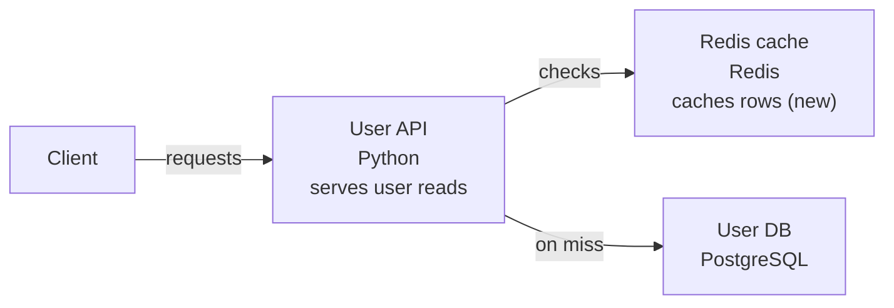

# Generate a change diagram

lgtmaybe can post a **compact flowchart of what a pull request changes** — the
components the PR touches plus their immediate relationships — so a reviewer
gets a visual overview before they read the diff. It's a separate concern from
the review and the description: enable any of them independently.

## Contents

- [What you get](#what-you-get)
- [On GitHub: `/diagram` and `auto_diagram`](#on-github-diagram-and-auto_diagram)
- [Locally: `lgtmaybe diagram`](#locally-lgtmaybe-diagram)
- [Why Mermaid (and what the ASCII is for)](#why-mermaid-and-what-the-ascii-is-for)
- [See also](#see-also)

## What you get

One model call returns two renderings of the same graph:

- a **Mermaid flowchart**, which GitHub renders natively inside the comment —
  no image, no external hosting; and
- a **plain-text ASCII** rendering of the same diagram, which is what shows in a
  terminal and serves as the fallback if the Mermaid can't be rendered.

The flowchart is intentionally sparse: it uses at most six nodes, short
relationship labels, and Mermaid's automatic layout. Changed elements are
marked in their labels (`(new)` / `(changed)`), keeping labels and arrows clear
of neighbouring cards. Because GitHub's renderer offers zoom buttons but no
full-screen, the diagram is followed by an **⛶ Open full screen** link that
renders the same diagram alone in a browser tab, with pan and zoom, on
[mermaid.live](https://mermaid.live). The source travels compressed in the URL
fragment, decoded in your browser, so nothing is sent anywhere until you click.
The diagram also stays honest about the diff being only a slice of the
codebase: relationships inferred from imports rather than shown in the diff
are called out in the notes.

Here is what the posted comment looks like for a PR that puts a Redis cache in
front of a user service — the Mermaid renders in place, with the ASCII tucked
in a collapsible "Text version" underneath:

> **Cache user lookups in Redis**



> [⛶ Open full screen](https://mermaid.live)&nbsp; *(the real link carries the
> diagram source compressed into the URL)*

<details>
<summary>Text version</summary>

```
[Client] --> [User API] --check--> [Redis cache] (new)
                  |
                  +--miss--> [User DB]
```

</details>

> *The User DB link is inferred from an import, not shown in the diff.*

## On GitHub: `/diagram` and `auto_diagram`

Comment **`/diagram`** on a pull request to post (or update in place) the change
diagram. Like `/describe`, it's an idempotent upsert — re-running edits the same
comment instead of stacking new ones.

`auto_diagram` is **on by default** — no workflow input or `.lgtmaybe.yml`
needed — so a diagram posts automatically when a PR is opened or reopened. It
never fires on a `synchronize` push. To opt out, set it in your workflow:

```yaml
      - uses: MattJColes/lgtmaybe@v1
        with:
          provider: anthropic
          model: claude-sonnet-4-6
          auto_diagram: "false"
        env:
          ANTHROPIC_API_KEY: ${{ secrets.ANTHROPIC_API_KEY }}
```

or in `.lgtmaybe.yml`:

```yaml
auto_diagram: false
```

The diagram is best-effort — a failure is logged and never blocks the review.

## Locally: `lgtmaybe diagram`

`lgtmaybe diagram` prints a diagram of your local changes — no GitHub involved:

```console
$ lgtmaybe diagram --provider ollama --model llama3
```

It diffs your branch against the base (the same base resolution as `lgtmaybe
review`; `--base` overrides, `--working` includes uncommitted edits,
`--uncommitted` reviews only the working-tree edits). The output is the same
Markdown body the `/diagram` comment carries — the Mermaid source first, then
the ASCII rendering (which reads fine in a terminal) in a collapsed "Text
version" block. Paste the Mermaid into a GitHub comment,
[mermaid.live](https://mermaid.live), or a Markdown file to render it.

## Why Mermaid (and what the ASCII is for)

GitHub renders **Mermaid** natively in comments and Markdown, so a `mermaid`
fenced flowchart renders in the comment with no image to generate or host.
That matters for a `pull_request_target` reviewer: hosting an image would mean
committing a file or calling an external service, neither of which fits a
fork-safe, idempotently-updated comment.

A terminal, though, can't render Mermaid — which is exactly why the same call
also returns **ASCII art**. Both the CLI output and the GitHub comment show the
Mermaid with the ASCII tucked in a collapsible "Text version" — the ASCII is
what you actually read in a terminal, and it doubles as the fallback body, so a
reviewer never sees a red "unable to render" box if a diagram comes back
malformed.

D2 isn't used because GitHub doesn't render it in Markdown, so it would show as
source anyway.

## See also

- [Configure `.lgtmaybe.yml`](configure-lgtmaybe-yml.md)
- [Use as a GitHub Action](use-as-github-action.md)
- [Configuration reference](../reference/config.md)
