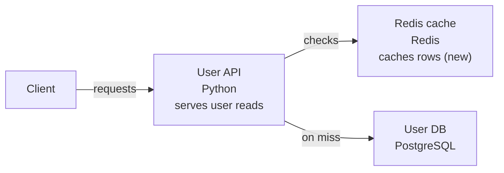
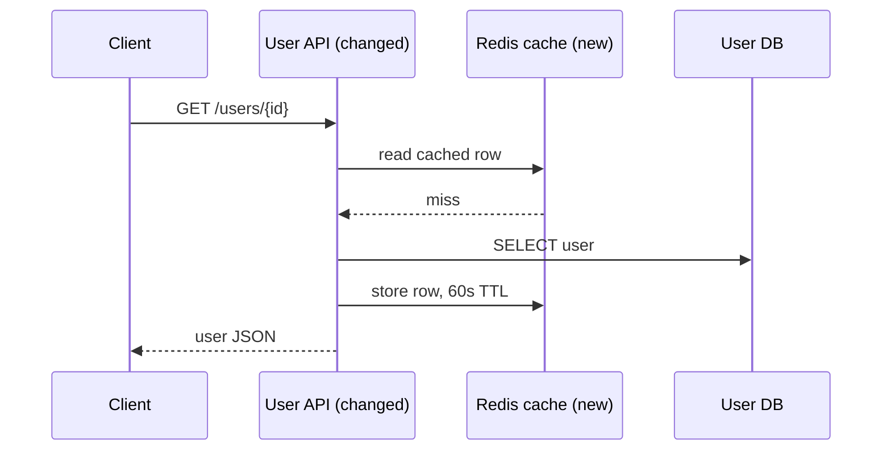
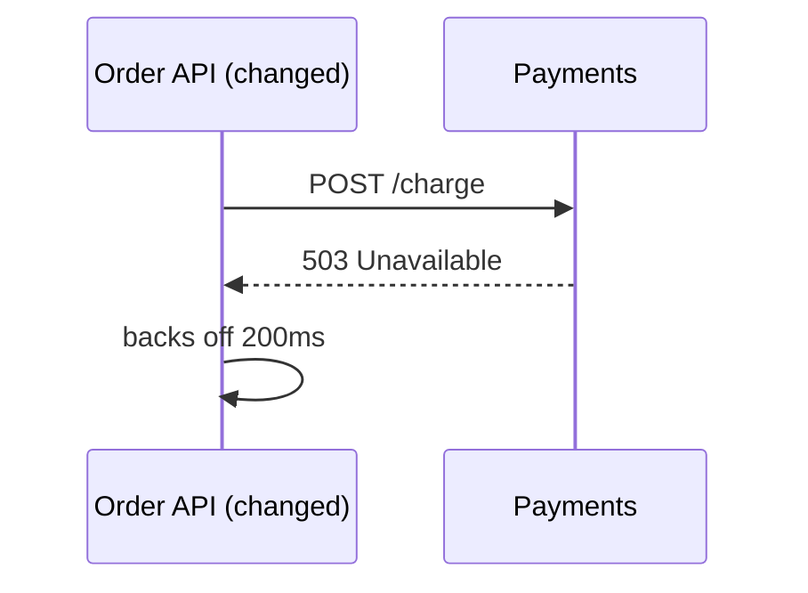

# Generate a change overview

lgtmaybe can post a **change overview** on a pull request: what the change is,
what is risky about it, and what it touches. It is one comment, updated in
place, that a reviewer reads before the diff. A separate concern from the
review — the review finds bugs in the lines it reads, the overview describes the
change as a whole.

## Contents

- [What you get](#what-you-get)
- [High Impact Areas](#high-impact-areas)
- [Structure and sequence](#structure-and-sequence)
- [On GitHub: `/diagram` and `auto_diagram`](#on-github-diagram-and-auto_diagram)
- [Locally: `lgtmaybe diagram`](#locally-lgtmaybe-diagram)
- [Why Mermaid (and what the ASCII is for)](#why-mermaid-and-what-the-ascii-is-for)
- [See also](#see-also)

## What you get

Three focused model calls, run concurrently, compose one comment in reading
order:

1. a **description** — a suggested title, the change type, a short summary, a
   per-file walkthrough, and a "does it do what it says" check when the PR
   states an intent (`auto_describe`);
2. **[High Impact Areas](#high-impact-areas)** — the changes a reviewer must not
   miss, in a bold-titled section (`high_impact`);
3. up to two **diagrams**, each in two renderings — a **Mermaid flowchart** of
   the structure, a **Mermaid sequence diagram** of the run-time flow when the
   change alters one, and a **plain-text rendering** of each, which is what
   shows in a terminal and serves as the fallback if the Mermaid can't be
   rendered.

Three calls rather than one because a single prompt doing three jobs does all
three worse. They run at the same time, so the overview costs about as much
wall-clock as its slowest call rather than the sum of the three. Each section
has its own switch, and the description and High Impact Areas sections are
best-effort: if one of those calls fails, its slot says so and the rest of the
comment still posts.

GitHub renders both Mermaid diagrams natively inside the comment — no image, no
external hosting.

The flowchart is intentionally sparse: it uses at most six nodes, short
relationship labels, and Mermaid's automatic layout. Changed elements are
marked in their labels (`(new)` / `(changed)`), keeping labels and arrows clear
of neighbouring cards. Because GitHub's renderer offers zoom buttons but no
full-screen, the diagram is followed by an **⛶ Open full screen** link that
renders the same diagram alone in a browser tab, with pan and zoom, on
[mermaid.live](https://mermaid.live). The source travels compressed in the URL
fragment, decoded in your browser, so nothing is sent anywhere until you click.
The diagram also stays honest about the diff being only a slice of the
codebase: relationships inferred from imports rather than shown in the diff
are called out in the notes.

Here is what the posted comment looks like for a PR that puts a Redis cache in
front of a user service — the Mermaid renders in place, with the ASCII tucked
in a collapsible "Text version" underneath:

> ## Cache user lookups in Redis

> **Change type:** feature

> User reads now check Redis before PostgreSQL, and successful database reads
> populate the cache for later requests.

> ### **High Impact Areas**
>
> - **Infrastructure** — New ElastiCache cluster (`infra/redis.tf`). Adds a
>   managed dependency to the production VPC. _Check:_ security group and
>   failover settings.
> - **Availability** — Cache on the user read path (`api/users.py`). User reads
>   now depend on Redis, so a Redis outage takes reads down with it. _Check:_
>   confirm a Redis error falls back to the database.
> - **Backup and recovery** — touched: `ops/backup_retention.tf` (not assessed
>   by the model)

> ### Structure



> [⛶ Open full screen](https://mermaid.live)&nbsp; *(the real link carries the
> diagram source compressed into the URL)*

<details>
<summary>Text version</summary>

```
[Client] --> [User API] --check--> [Redis cache] (new)
                  |
                  +--miss--> [User DB]
```

</details>

> ### Sequence



<details>
<summary>Text version</summary>

```
1. [Client] -> [User API (changed)]: GET /users/{id}
2. [User API (changed)] -> [Redis cache (new)]: read cached row
3. [Redis cache (new)] --> [User API (changed)]: miss
4. [User API (changed)] -> [User DB]: SELECT user
5. [User API (changed)] -> [Redis cache (new)]: store row, 60s TTL
6. [User API (changed)] --> [Client]: user JSON
```

</details>

> *The User DB link is inferred from an import, not shown in the diff.*

## High Impact Areas

A review reads the changed lines and tells you what is wrong in them. It cannot
tell you that halving a node count removes your peak headroom, or that the PR
quietly shortened a backup retention policy. **High Impact Areas** asks the
other question — *what could this change break beyond itself?* — and answers it
in one bold-titled section at the top of the overview.

Ten areas are checked:

| Area | What it covers |
|---|---|
| **Infrastructure** | IaC, Kubernetes/Helm, container images, CI/CD pipelines, deploy scripts, networking, DNS, load balancers, resource sizing |
| **Security** | Authentication, authorisation, IAM or permission scope, cryptography, secret handling, removed input validation, CORS/CSP/TLS, CI workflow permissions |
| **Availability** | Anything that could cause a production outage: startup and config defaults, timeouts, retries, circuit breakers, connection pools, rate limits, health checks, removed error handling, concurrency and locking, runtime or major dependency upgrades, hot-path performance, rollback and deploy ordering |
| **Data migration** | Schema or data migrations, destructive or irreversible data operations, backfills |
| **Backup and recovery** | Backup jobs, retention and lifecycle policies, snapshots, restore paths, disaster recovery, failover, replication |
| **Compatibility** | Breaking an external contract: HTTP APIs, event or message schemas, CLI flags, SDK surface, wire formats, feature-flag removal |
| **Observability** | Logs, metrics, alerts, dashboards, tracing, audit trails or runbooks being removed, silenced or changed |
| **Dependencies** | Supply chain: new dependencies, major bumps, loosened pins, lockfiles, base images, build toolchain |
| **Cost** | Autoscaling limits, instance types, provisioned capacity, storage classes, quotas |
| **Compliance** | PII or privacy handling, audit trails, data residency, licence changes |

Each call-out names the area, a short headline, the files it comes from, the
blast radius, and the one thing a reviewer should verify.

### The path floor

The model is not the only source. Before the call, lgtmaybe matches the PR's
changed **paths** against deterministic patterns per area — `*.tf`,
`.github/workflows/`, `alembic/`, anything named for backups or retention,
lockfiles, and so on. Those matches do two jobs:

- they are sent to the model as untrusted hints, saying *where* to look (never
  that anything is wrong);
- they **floor** the output. An area whose files the model said nothing about is
  still listed, marked `(not assessed by the model)`, so a weak model cannot
  make your Terraform change invisible.

The floor is also the fallback: if the call fails or returns nothing usable, the
section renders the path signals alone under a "model assessment unavailable"
note. It degrades — it never disappears.

When nothing qualifies, the section says so and names what it checked, rather
than silently vanishing:

> ### **High Impact Areas**
>
> None detected — checked: infrastructure, security posture, availability, data
> migrations, backups and recovery, compatibility, observability, dependencies,
> cost, compliance.

### Turning it off

The section is on by default. To drop it and its model call:

```yaml
high_impact: false
```

The description section has its own switch, `auto_describe: false`. With both
off, the comment is just the diagrams, and costs one call.

## Structure and sequence

The two diagrams answer different questions, which is why lgtmaybe draws both:

| | Answers | Best on |
|---|---|---|
| **Flowchart** (structure) | What does this change touch, and what talks to what? | Structural PRs — a component added, a dependency introduced, a service split |
| **Sequence** | What happens at run time, in what order, and where did that change? | Behavioural PRs — a retry added, an ordering fixed, a signal now handled |

Most pull requests are behavioural, and structure alone under-describes them: a
PR that fixes terminal restoration on `SIGTERM` might touch two files and draw
three boxes, while its sequence diagram — signal, flag set, loop exit, guard
dropped, terminal restored — *is* the explanation of the fix. A PR that puts a
cache in front of a service is the opposite: the new box is the headline, and
the flow shows how a request now reaches it.

The sequence view is **omitted entirely** when the change has no meaningful
run-time flow — documentation, configuration, formatting — rather than inventing
one. Both diagrams share one model call, one PR comment, and the same
six-component budget; the sequence view adds at most eight ordered steps.

## On GitHub: `/diagram` and `auto_diagram`

Comment **`/diagram`** on a pull request to post (or update in place) the change
overview. It's an idempotent upsert — re-running edits the same comment instead
of stacking new ones. (`/describe` still posts a description as its own separate
comment, for when that is all you want.)

`auto_diagram` is **on by default** — no workflow input or `.lgtmaybe.yml`
needed — so the overview posts automatically when a PR is opened or reopened and
refreshes after later pushes, keeping every section current with the head
commit. To opt out of the whole comment, set it in your workflow:

```yaml
      - uses: MattJColes/lgtmaybe@v2
        with:
          provider: anthropic
          model: claude-sonnet-4-6
          auto_diagram: "false"
        env:
          ANTHROPIC_API_KEY: ${{ secrets.ANTHROPIC_API_KEY }}
```

or in `.lgtmaybe.yml`:

```yaml
auto_diagram: false
```

The description and High Impact Areas sections are best-effort: a failure there
is logged, leaves a visible note in its slot, and never blocks the rest. The
diagram itself is a required completion step, so a failed diagram leaves the
commit un-finished and the next run redoes it rather than silently skipping it.

## Locally: `lgtmaybe diagram`

`lgtmaybe diagram` prints the change overview of your local changes — no GitHub
involved:

```console
$ lgtmaybe diagram --provider ollama --model llama3
```

It diffs your branch against the base (the same base resolution as `lgtmaybe
review`; `--base` overrides, `--working` includes uncommitted edits,
`--uncommitted` reviews only the working-tree edits). The output is the same
body the `/diagram` comment carries — description, High Impact Areas, then each
diagram's Mermaid source and its text rendering — with one adaptation: a
terminal renders no HTML, so the collapsible "Text version" wrapper is flattened
into a plain labelled section:

````console
$ lgtmaybe diagram --provider ollama --model llama3

### Sequence



Text version:

```
1. [Order API (changed)] -> [Payments]: POST /charge
2. [Payments] --> [Order API (changed)]: 503 Unavailable
3. [Order API (changed)] -> [Order API (changed)]: backs off 200ms
```
````

The Mermaid source stays in the output on purpose: your terminal can't draw it,
but it is what you paste into a GitHub comment,
[mermaid.live](https://mermaid.live), or a Markdown file to render it.

## Why Mermaid (and what the ASCII is for)

GitHub renders **Mermaid** natively in comments and Markdown — both flowcharts
and sequence diagrams — so a `mermaid` fence renders in the comment with no
image to generate or host. That matters for a `pull_request_target` reviewer:
hosting an image would mean committing a file or calling an external service,
neither of which fits a fork-safe, idempotently-updated comment.

A terminal, though, can't render Mermaid — which is exactly why each diagram
also comes as **plain text**. In the GitHub comment that text sits in a
collapsible "Text version" block, out of the way of the rendered diagram; in the
terminal the same block is flattened to a labelled section, because HTML tags
are noise in a shell. Either way the text is what you actually read without a
renderer, and it doubles as the fallback body, so a reviewer never sees a red
"unable to render" box if a diagram comes back malformed.

The model never writes Mermaid. It returns typed graph data — components,
relationships, ordered steps — and lgtmaybe renders the syntax itself, escaping
every label, so a diff that tries to smuggle diagram source or markup into a
label can't reach the fence.

D2 isn't used because GitHub doesn't render it in Markdown, so it would show as
source anyway.

## See also

- [Configure `.lgtmaybe.yml`](configure-lgtmaybe-yml.md)
- [Use as a GitHub Action](use-as-github-action.md)
- [Configuration reference](../reference/config.md)
