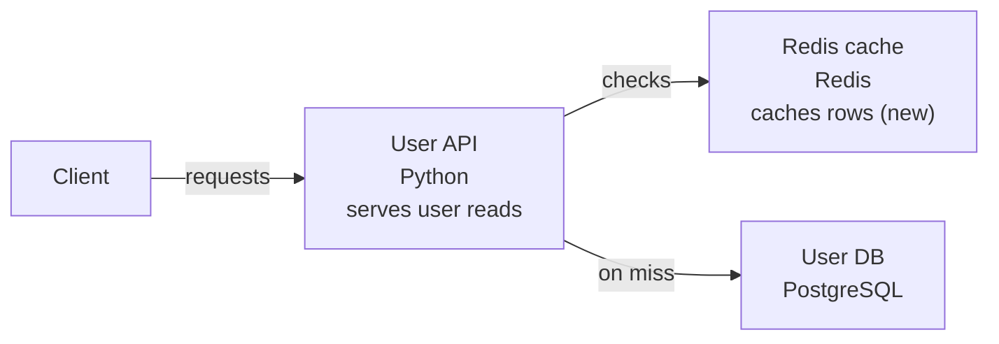
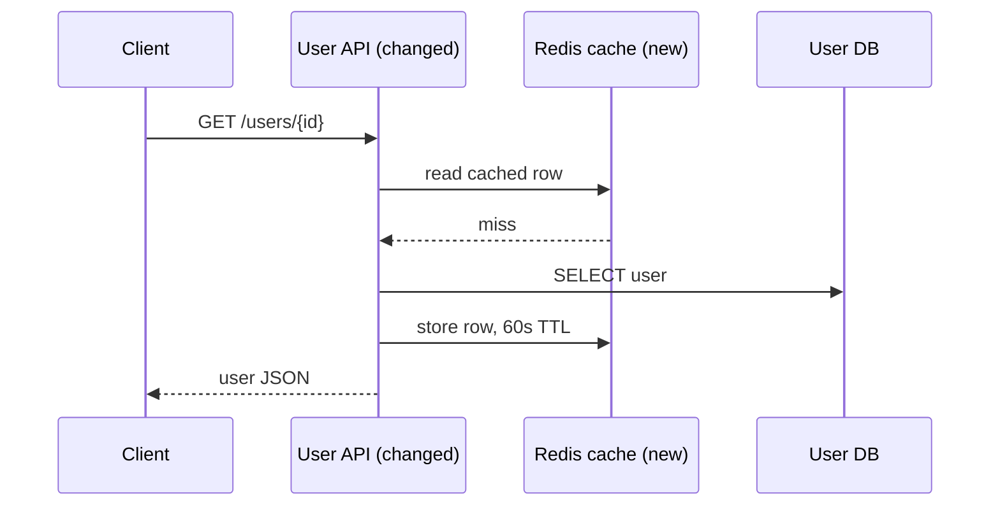
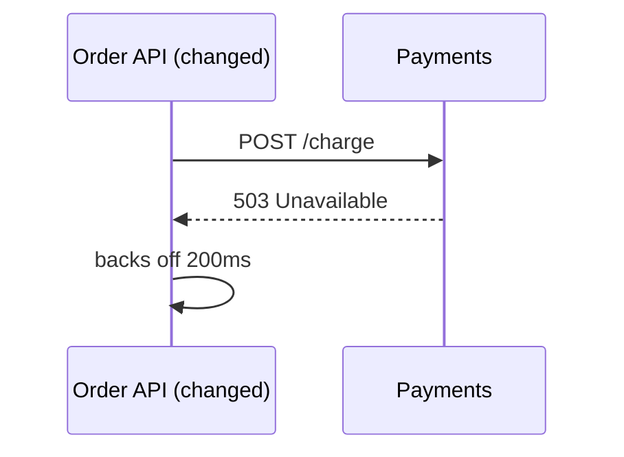

# Generate a change diagram

lgtmaybe can post a **compact picture of what a pull request changes** — the
components the PR touches and the run-time flow it alters — so a reviewer gets a
visual overview before they read the diff. It's a separate concern from the
review and the description: enable any of them independently.

## Contents

- [What you get](#what-you-get)
- [Structure and sequence](#structure-and-sequence)
- [On GitHub: `/diagram` and `auto_diagram`](#on-github-diagram-and-auto_diagram)
- [Locally: `lgtmaybe diagram`](#locally-lgtmaybe-diagram)
- [Why Mermaid (and what the ASCII is for)](#why-mermaid-and-what-the-ascii-is-for)
- [See also](#see-also)

## What you get

One model call returns a concise summary of what changed and up to two diagrams,
each in two renderings:

- a **Mermaid flowchart** of the structure — what the change touches and how
  those pieces connect;
- a **Mermaid sequence diagram** of the flow — what happens at run time, and in
  what order — included only when the change actually alters a flow;
- a **plain-text rendering** of each, which is what shows in a terminal and
  serves as the fallback if the Mermaid can't be rendered.

GitHub renders both Mermaid diagrams natively inside the comment — no image, no
external hosting.

The flowchart is intentionally sparse: it uses at most six nodes, short
relationship labels, and Mermaid's automatic layout. Changed elements are
marked in their labels (`(new)` / `(changed)`), keeping labels and arrows clear
of neighbouring cards. Because GitHub's renderer offers zoom buttons but no
full-screen, the diagram is followed by an **⛶ Open full screen** link that
renders the same diagram alone in a browser tab, with pan and zoom, on
[mermaid.live](https://mermaid.live). The source travels compressed in the URL
fragment, decoded in your browser, so nothing is sent anywhere until you click.
The diagram also stays honest about the diff being only a slice of the
codebase: relationships inferred from imports rather than shown in the diff
are called out in the notes.

Here is what the posted comment looks like for a PR that puts a Redis cache in
front of a user service — the Mermaid renders in place, with the ASCII tucked
in a collapsible "Text version" underneath:

> **Cache user lookups in Redis**

> User reads now check Redis before PostgreSQL, and successful database reads
> populate the cache for later requests.

> ### Structure



> [⛶ Open full screen](https://mermaid.live)&nbsp; *(the real link carries the
> diagram source compressed into the URL)*

<details>
<summary>Text version</summary>

```
[Client] --> [User API] --check--> [Redis cache] (new)
                  |
                  +--miss--> [User DB]
```

</details>

> ### Sequence



<details>
<summary>Text version</summary>

```
1. [Client] -> [User API (changed)]: GET /users/{id}
2. [User API (changed)] -> [Redis cache (new)]: read cached row
3. [Redis cache (new)] --> [User API (changed)]: miss
4. [User API (changed)] -> [User DB]: SELECT user
5. [User API (changed)] -> [Redis cache (new)]: store row, 60s TTL
6. [User API (changed)] --> [Client]: user JSON
```

</details>

> *The User DB link is inferred from an import, not shown in the diff.*

## Structure and sequence

The two diagrams answer different questions, which is why lgtmaybe draws both:

| | Answers | Best on |
|---|---|---|
| **Flowchart** (structure) | What does this change touch, and what talks to what? | Structural PRs — a component added, a dependency introduced, a service split |
| **Sequence** | What happens at run time, in what order, and where did that change? | Behavioural PRs — a retry added, an ordering fixed, a signal now handled |

Most pull requests are behavioural, and structure alone under-describes them: a
PR that fixes terminal restoration on `SIGTERM` might touch two files and draw
three boxes, while its sequence diagram — signal, flag set, loop exit, guard
dropped, terminal restored — *is* the explanation of the fix. A PR that puts a
cache in front of a service is the opposite: the new box is the headline, and
the flow shows how a request now reaches it.

The sequence view is **omitted entirely** when the change has no meaningful
run-time flow — documentation, configuration, formatting — rather than inventing
one. When only the flowchart renders, the `Structure` / `Sequence` headings drop
away too, so a small change stays a small comment. Both diagrams share one model
call, one PR comment, and the same six-component budget; the sequence view adds
at most eight ordered steps.

## On GitHub: `/diagram` and `auto_diagram`

Comment **`/diagram`** on a pull request to post (or update in place) the change
diagram. Like `/describe`, it's an idempotent upsert — re-running edits the same
comment instead of stacking new ones.

`auto_diagram` is **on by default** — no workflow input or `.lgtmaybe.yml`
needed — so a diagram posts automatically when a PR is opened or reopened and
refreshes after later pushes. To opt out, set it in your workflow:

```yaml
      - uses: MattJColes/lgtmaybe@v2
        with:
          provider: anthropic
          model: claude-sonnet-4-6
          auto_diagram: "false"
        env:
          ANTHROPIC_API_KEY: ${{ secrets.ANTHROPIC_API_KEY }}
```

or in `.lgtmaybe.yml`:

```yaml
auto_diagram: false
```

The diagram is best-effort — a failure is logged and never blocks the review.

## Locally: `lgtmaybe diagram`

`lgtmaybe diagram` prints a diagram of your local changes — no GitHub involved:

```console
$ lgtmaybe diagram --provider ollama --model llama3
```

It diffs your branch against the base (the same base resolution as `lgtmaybe
review`; `--base` overrides, `--working` includes uncommitted edits,
`--uncommitted` reviews only the working-tree edits). The output is the same
body the `/diagram` comment carries — each diagram's Mermaid source first, then
its text rendering — with one adaptation: a terminal renders no HTML, so the
collapsible "Text version" wrapper is flattened into a plain labelled section:

````console
$ lgtmaybe diagram --provider ollama --model llama3

### Sequence



Text version:

```
1. [Order API (changed)] -> [Payments]: POST /charge
2. [Payments] --> [Order API (changed)]: 503 Unavailable
3. [Order API (changed)] -> [Order API (changed)]: backs off 200ms
```
````

The Mermaid source stays in the output on purpose: your terminal can't draw it,
but it is what you paste into a GitHub comment,
[mermaid.live](https://mermaid.live), or a Markdown file to render it.

## Why Mermaid (and what the ASCII is for)

GitHub renders **Mermaid** natively in comments and Markdown — both flowcharts
and sequence diagrams — so a `mermaid` fence renders in the comment with no
image to generate or host. That matters for a `pull_request_target` reviewer:
hosting an image would mean committing a file or calling an external service,
neither of which fits a fork-safe, idempotently-updated comment.

A terminal, though, can't render Mermaid — which is exactly why each diagram
also comes as **plain text**. In the GitHub comment that text sits in a
collapsible "Text version" block, out of the way of the rendered diagram; in the
terminal the same block is flattened to a labelled section, because HTML tags
are noise in a shell. Either way the text is what you actually read without a
renderer, and it doubles as the fallback body, so a reviewer never sees a red
"unable to render" box if a diagram comes back malformed.

The model never writes Mermaid. It returns typed graph data — components,
relationships, ordered steps — and lgtmaybe renders the syntax itself, escaping
every label, so a diff that tries to smuggle diagram source or markup into a
label can't reach the fence.

D2 isn't used because GitHub doesn't render it in Markdown, so it would show as
source anyway.

## See also

- [Configure `.lgtmaybe.yml`](configure-lgtmaybe-yml.md)
- [Use as a GitHub Action](use-as-github-action.md)
- [Configuration reference](../reference/config.md)
