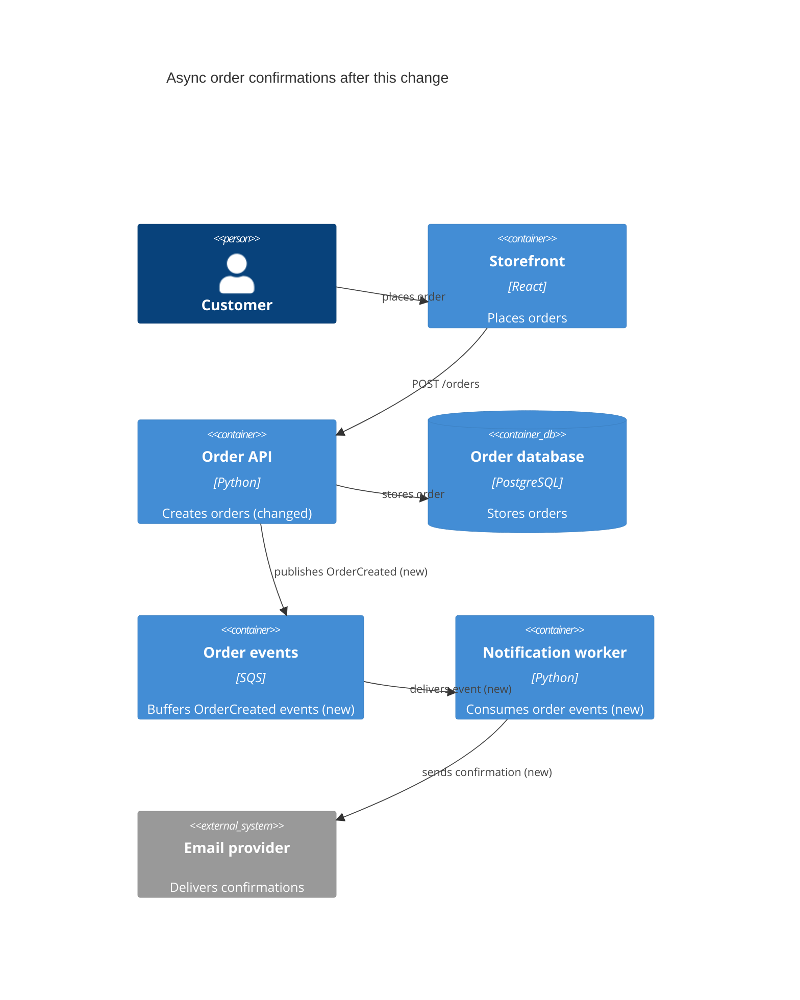

{ width="128" }

# lgtmaybe

lgtmaybe reviews the code a pull request changes. Pick OpenAI, Claude, Bedrock,
Vertex, Azure, ollama, or any OpenAI-compatible endpoint, then run it as a
GitHub Action or from your terminal. GitHub gets inline comments and one
summary; locally, you get the same findings before you push.

It reads the diff and a little surrounding code, but only comments on changed
lines. On GitHub it never checks out or runs the pull request. Generated files
and binaries are skipped, secrets are redacted, and all PR text is treated as
untrusted.

It checks for:

- **Correctness and security** — logic errors, missed `await`s, injection, auth mistakes, and leaked secrets.
- **Code health** — performance problems, needless complexity, deprecations, and risky dependencies.
- **Tests and documentation** — missing or weak tests, stale comments, and undocumented APIs.
- **Intent** — whether the change does what its title, description, and commits say it does.
- **Ponytail** — code you don't need, standard-library opportunities, and simpler ways to get the job done.

Findings are graded from `info` to `critical` and land on the exact changed
line. A clean change just gets a 👍 **LGTM!**.

![An inline lgtmaybe review comment flagging a [CRITICAL] SQL injection vulnerability, with an explanation and a committable parameterized-query suggestion](assets/marketplace/marketplace-screenshot-1.png){ width="720" }

Reviews aren't all it does. **`/review`** and **`/improve`** run the review,
**`/describe`** writes a structured overview, **`/diagram`** draws a
[C4-style map of the change](how-to/generate-a-change-diagram.md), and
**`/ask <question>`** answers in the PR. Run `lgtmaybe diagram` to draw the same
map locally before you push.

## Start here

- **Tutorial** — [Getting started](tutorial/getting-started.md): your first review with ollama, locally and free.
- **How-to** — task recipes: [run locally](how-to/run-locally-with-ollama.md), [Bedrock OIDC](how-to/review-with-bedrock-oidc.md), [Vertex WIF](how-to/review-with-vertex-wif.md), [Azure OpenAI](how-to/review-with-azure.md), [GitHub Action](how-to/use-as-github-action.md).
- **Reference** — [Configuration](reference/config.md): every config field and schema.
- **Explanation** — [What gets reviewed](explanation/what-gets-reviewed.md), [Architecture](explanation/architecture.md), [Auth model](explanation/auth-model.md), [Data & privacy](explanation/data-and-privacy.md).

## Providers

| Provider | Auth |
|---|---|
| `openai` | `OPENAI_API_KEY` |
| `anthropic` | `ANTHROPIC_API_KEY` |
| `openrouter` | `OPENROUTER_API_KEY` |
| `zai` | `ZAI_API_KEY` — GLM / Zhipu AI; optional `--api-base` for the China / coding-plan endpoint |
| `bedrock` | Ambient AWS creds — GitHub OIDC, no static key |
| `vertex` | Ambient GCP creds — Workload Identity Federation, no key |
| `azure` | Ambient Azure AD creds — GitHub OIDC, no static key (or `AZURE_API_KEY`) + endpoint |
| `ollama` | None — local only, zero cost |
| `openai-compatible` | `--api-base` to any OpenAI `/v1` endpoint; key optional (placeholder for keyless local servers) |

## For AI agents

The site root publishes a curated [`llms.txt`](llms.txt) index of these docs,
plus a whole-corpus [`llms-full.txt`](llms-full.txt), for LLM crawlers and
coding agents.
