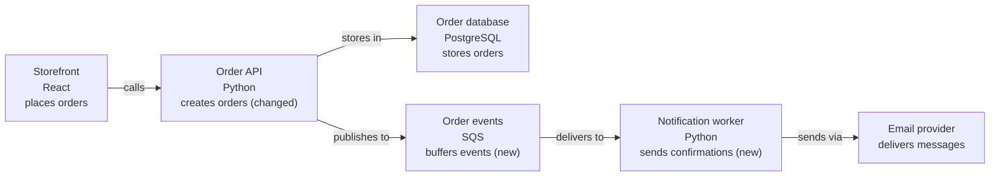

{ width="128" }

# lgtmaybe

lgtmaybe reviews pull and merge requests on **GitHub, GitLab, and Gitea**. You
can also review a local Git diff before pushing. Choose a hosted model, ollama,
or another OpenAI-compatible endpoint. Reviews on a code host post inline
comments and one summary; local reviews print findings in your terminal.

It reads the diff and a little surrounding code, but only comments on changed
lines. It never checks out or runs the change. Generated files and binaries are
skipped, secrets are redacted, and all author-supplied text is treated as
untrusted.

It checks for:

- **Correctness and security** — logic errors, missed `await`s, injection, auth mistakes, and leaked secrets.
- **Code health** — performance problems, needless complexity, deprecations, and risky dependencies.
- **Tests and documentation** — missing or weak tests, stale comments, and undocumented APIs.
- **Intent** — whether the change does what its title, description, and commits say it does.
- **Ponytail** — code you don't need, standard-library opportunities, and simpler ways to get the job done.

Findings are graded from `info` to `critical` and land on the exact changed
line. A clean change just gets a 👍 **LGTM!**.

![An inline lgtmaybe review comment flagging a [CRITICAL] SQL injection vulnerability, with an explanation and a committable parameterized-query suggestion](assets/marketplace/marketplace-screenshot-1.png){ width="720" }

Slash commands can refresh a review (`/review`, `/improve`), answer a question
(`/ask`), post a structured description (`/describe`), or post
[a change overview](how-to/generate-a-change-diagram.md) (`/diagram`). The
overview describes high-impact areas and includes a flowchart; it adds a
sequence diagram when the change alters a runtime flow. Run `lgtmaybe diagram`
to print a text version locally.

## Start here

- **Tutorial** — [Getting started](tutorial/getting-started.md): your first review with ollama, locally and free.
- **How-to** — task recipes: [choose a review model](how-to/choose-a-review-model.md), [run locally](how-to/run-locally-with-ollama.md), [Bedrock OIDC](how-to/review-with-bedrock-oidc.md), [Vertex WIF](how-to/review-with-vertex-wif.md), [Azure OpenAI](how-to/review-with-azure.md), [GitHub Action](how-to/use-as-github-action.md), [GitLab](how-to/review-on-gitlab.md), [Gitea](how-to/review-on-gitea.md).
- **Reference** — [Configuration](reference/config.md): every config field and schema.
- **Explanation** — [What gets reviewed](explanation/what-gets-reviewed.md), [Architecture](explanation/architecture.md), [Auth model](explanation/auth-model.md), [Data & privacy](explanation/data-and-privacy.md).

## Providers

| Provider | Auth |
|---|---|
| `openai` | `OPENAI_API_KEY` |
| `anthropic` | `ANTHROPIC_API_KEY` |
| `openrouter` | `OPENROUTER_API_KEY` |
| `zai` | `ZAI_API_KEY` — GLM / Zhipu AI; optional `--api-base` for the China / coding-plan endpoint |
| `bedrock` | Ambient AWS creds — GitHub OIDC, no static key |
| `vertex` | Ambient GCP creds — Workload Identity Federation, no key |
| `azure` | Ambient Azure AD creds — GitHub OIDC, no static key (or `AZURE_API_KEY`) + endpoint |
| `ollama` | None — local only, zero cost |
| `openai-compatible` | `--api-base` to any OpenAI `/v1` endpoint; key optional (placeholder for keyless local servers) |

## Where it posts

The model provider and the code host are independent — any provider above works
on any host below.

| Host | How it runs | Token | Guide |
|---|---|---|---|
| GitHub | GitHub Action | `GITHUB_TOKEN` | [GitHub Action](how-to/use-as-github-action.md) |
| GitLab | GitLab CI job | `GITLAB_TOKEN` | [Review on GitLab](how-to/review-on-gitlab.md) |
| Gitea | Gitea Actions | `GITEA_TOKEN` | [Review on Gitea](how-to/review-on-gitea.md) |
| None | `lgtmaybe review` locally | — | [Install the CLI](how-to/install-the-cli.md) |

The same review runs on all three hosts. Their APIs and workflows differ in
thread resolution, incremental reviews, and keyless cloud auth. See
[Architecture](explanation/architecture.md#code-hosts-forges) for the details.

## For AI agents

The site root publishes a curated [`llms.txt`](llms.txt) index of these docs,
plus a whole-corpus [`llms-full.txt`](llms-full.txt), for LLM crawlers and
coding agents.
