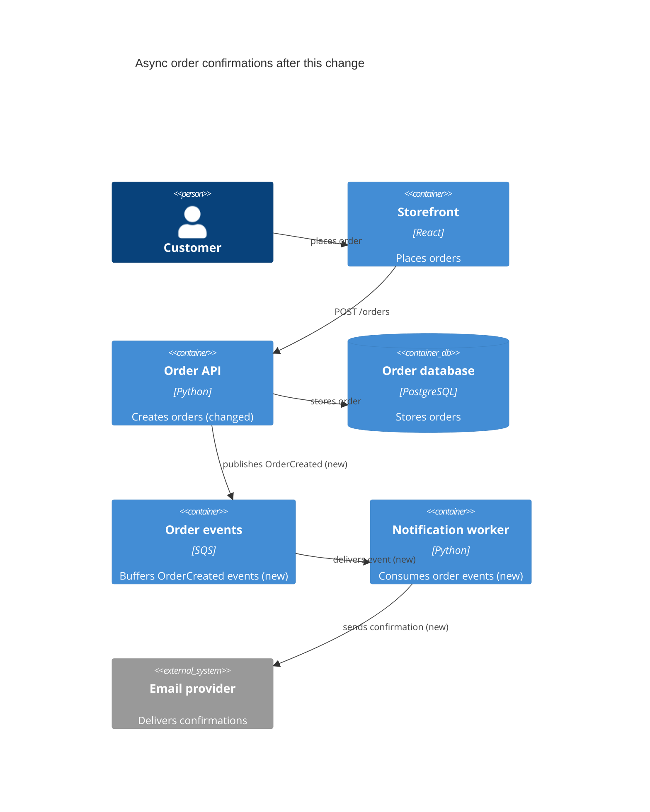

{ width="128" }

# lgtmaybe

Provider-agnostic AI PR reviewer. Seven hosted providers, local ollama, and any
OpenAI-compatible endpoint — one flag, and no static keys for cloud providers. It
posts inline comments and a summary straight onto the pull request.

lgtmaybe reviews the lines a change touches. It runs in two places: as a
GitHub Action on a pull request, or locally from the command line against your
`git` diff before you push. As an Action it fetches the diff from the GitHub API
and never checks out or runs your code. Locally it reads your working branch.
Either way it pads each change with a few surrounding lines, so a finding lands
with the function around it in view — but it only ever comments on the lines
that actually changed.

Reviews surface the things you'd want a careful reviewer to catch:

- **Logic and correctness bugs** — edge cases, null/None dereferences, off-by-one and boundary errors, mismatched or inverted ranges, unhandled error paths, races and TOCTOU, missed `await`s, and numeric or timezone bugs.
- **Security vulnerabilities** — an OWASP-aligned sweep: injection, XSS, CSRF and open redirects, hardcoded secrets, broken authn/authz (including JWT pitfalls), path traversal, unrestricted uploads, SSRF, insecure deserialization and XXE, mass assignment, weak crypto, resource/DoS safety (including ReDoS), secrets or PII (passwords, tokens, SSNs, card data) leaking into logs, and CI/IaC misconfiguration.
- **Missing or weak tests** — changed code paths shipped without a test (flagged with a suggested test to drop in), and tests that don't really test: assertion-free, over-mocked, or sleep-based.
- **Documentation gaps and stale docs** — public APIs added without a docstring, names that contradict what the code does, and docstrings or comments the change just made wrong.
- **Deprecated and end-of-life code** — deprecated APIs, end-of-life or vulnerable dependencies, and typosquat-looking additions, flagged when the diff shows them (with the modern replacement suggested where known).
- **Intent** — does the PR do what it says? lgtmaybe compares the PR title, description, and commit names (or your local `git log` commit names on the CLI) against the diff, and flags out-of-scope hunks, contradictions, and promised behaviour that never lands.
- **Ponytail** — the "lazy senior dev" lens: the best code is the code you never wrote. Flags code that needn't exist at all — YAGNI, reaching for the standard library, doing it in fewer lines.

Beyond the review itself, slash commands on the PR keep the reviewer's mental
model of the code intact: **`/describe`** posts a structured description of the
change (title, change type, per-file walkthrough, intent check), **`/diagram`**
posts a [C4-style Mermaid diagram of the components the PR touches](how-to/generate-a-change-diagram.md)
— a visual map of where the change sits in the system, rendered natively by
GitHub — and **`/ask <question>`** answers questions about the change in-thread.
`lgtmaybe diagram` prints the same change diagram locally, before you push.

Every finding is graded from `info` up to `critical`, so you can set the
severity floor that matters to you. Each one lands as an inline comment on
the exact line where the problem is, with a single summary at the top. On the CLI
the same findings print to your terminal — ready to read, or to hand to an AI
agent to apply. Before anything leaves for the model, generated files and
binaries are skipped, secrets are redacted, and the diff is treated as untrusted
input, hardened against prompt injection. A clean PR just gets a 👍 **LGTM!**.

## Start here

- **Tutorial** — [Getting started](tutorial/getting-started.md): your first review with ollama, locally and free.
- **How-to** — task recipes: [run locally](how-to/run-locally-with-ollama.md), [Bedrock OIDC](how-to/review-with-bedrock-oidc.md), [Vertex WIF](how-to/review-with-vertex-wif.md), [Azure OpenAI](how-to/review-with-azure.md), [GitHub Action](how-to/use-as-github-action.md).
- **Reference** — [Configuration](reference/config.md): every config field and schema.
- **Explanation** — [What gets reviewed](explanation/what-gets-reviewed.md), [Architecture](explanation/architecture.md), [Auth model](explanation/auth-model.md), [Data & privacy](explanation/data-and-privacy.md).

## Providers

| Provider | Auth |
|---|---|
| `openai` | `OPENAI_API_KEY` |
| `anthropic` | `ANTHROPIC_API_KEY` |
| `openrouter` | `OPENROUTER_API_KEY` |
| `zai` | `ZAI_API_KEY` — GLM / Zhipu AI; optional `--api-base` for the China / coding-plan endpoint |
| `bedrock` | Ambient AWS creds — GitHub OIDC, no static key |
| `vertex` | Ambient GCP creds — Workload Identity Federation, no key |
| `azure` | Ambient Azure AD creds — GitHub OIDC, no static key (or `AZURE_API_KEY`) + endpoint |
| `ollama` | None — local only, zero cost |
| `openai-compatible` | `--api-base` to any OpenAI `/v1` endpoint; key optional (placeholder for keyless local servers) |

## For AI agents

The site root publishes a curated [`llms.txt`](llms.txt) index of these docs,
plus a whole-corpus [`llms-full.txt`](llms-full.txt), for LLM crawlers and
coding agents.
